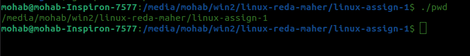
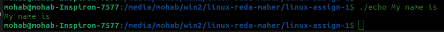
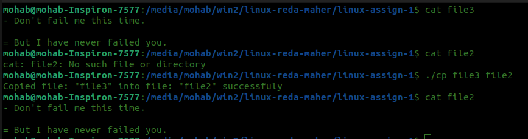
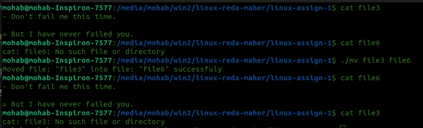

**1. Print Working Directory (pwd)**

To use this utility

```bash
gcc pwd.c -o pwd
./pwd
```

Working example



---


**2. Print (echo)**

To use this utility

```bash
gcc echo.c -o echo
./echo Desired text
```

Working example



---

**3. Copy (cp)**

To use this utility

```bash
gcc cp.c -o cp
./cp file1 file2
```

Working example



---

**4. Move (mv)**

To use this utility

```bash
gcc mv.c -o mv
./mv
```

Working example



---
